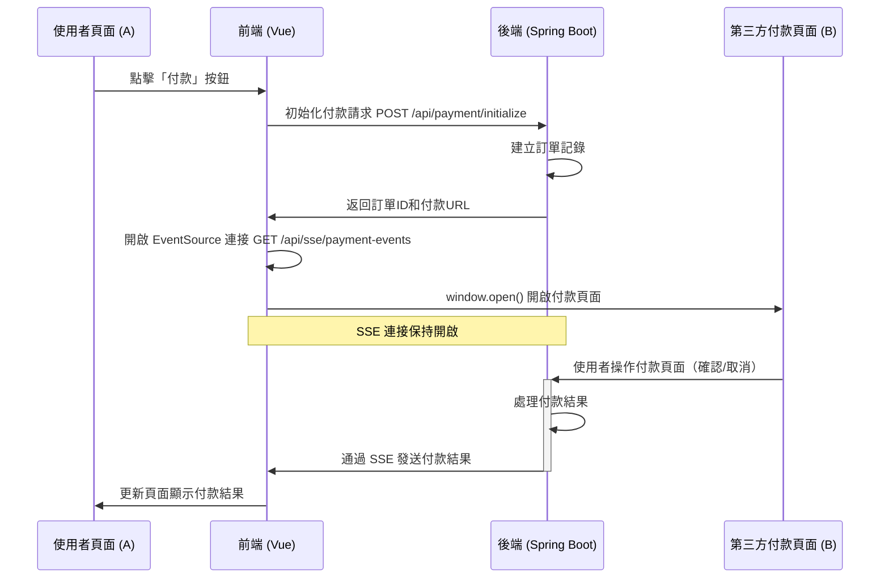

# Server-Sent Events 第三方付款 POC

這是一個使用 Server-Sent Events (SSE) 實現的模擬第三方付款系統，展示了如何在不同頁面間通過 SSE 進行即時通訊。主要用於展示當使用者從原始頁面跳轉到第三方付款頁面後，如何將付款結果即時通知回原頁面。

## 系統架構

- **Frontend**: Vue 3 + TypeScript + Pinia 實現的單頁面應用
- **Backend**: Spring Boot 3 + WebFlux 實現的響應式後端服務

## 系統流程

付款流程：



### 詳細流程

1. 使用者在頁面 A 點擊「付款」按鈕
2. 前端向後端發送初始化付款請求
3. 後端建立訂單並返回訂單資訊和付款頁面 URL
4. 前端使用 EventSource API 與後端建立 SSE 連接
5. 前端使用 window.open() 開啟新視窗顯示第三方付款頁面 B
6. 使用者在付款頁面 B 進行操作（確認付款或取消付款）
7. 付款頁面 B 向後端發送付款結果
8. 後端更新訂單狀態並通過 SSE 連接將結果推送給頁面 A
9. 頁面 A 收到結果後更新介面顯示付款結果


```
     /-- 訂閱者1 (瀏覽器頁面A)
發布事件 --> 多播Sink ------- 訂閱者2 (瀏覽器頁面B)
     \-- 訂閱者3 (監控系統)
```