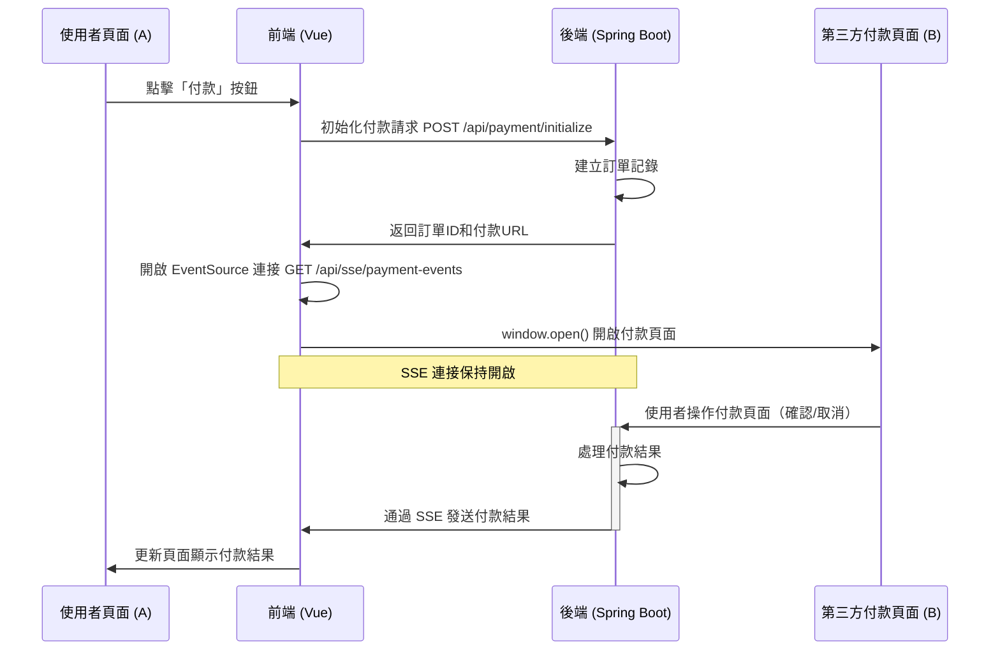

# Server-Sent Events 第三方付款 POC

這是一個使用 Server-Sent Events (SSE) 實現的模擬第三方付款系統，展示了如何在不同頁面間通過 SSE 進行即時通訊。主要用於展示當使用者從原始頁面跳轉到第三方付款頁面後，如何將付款結果即時通知回原頁面。

## 系統架構

- **Frontend**: Vue 3 + TypeScript + Pinia 實現的單頁面應用
- **Backend**: Spring Boot 3 + WebFlux 實現的響應式後端服務

## 系統流程

付款流程：



### 詳細流程

1. 使用者在頁面 A 點擊「付款」按鈕
2. 前端向後端發送初始化付款請求
3. 後端建立訂單並返回訂單資訊和付款頁面 URL
4. 前端使用 EventSource API 與後端建立 SSE 連接
5. 前端使用 window.open() 開啟新視窗顯示第三方付款頁面 B
6. 使用者在付款頁面 B 進行操作（確認付款或取消付款）
7. 付款頁面 B 向後端發送付款結果
8. 後端更新訂單狀態並通過 SSE 連接將結果推送給頁面 A
9. 頁面 A 收到結果後更新介面顯示付款結果

## 前端實現 (Frontend)

### 技術

- Vue 3
- TypeScript
- Pinia (狀態管理)
- EventSource API (SSE 客戶端)

### 主要組件

#### Pinia Store

`/src/stores/payment.ts` 是整個前端的核心，負責管理付款狀態和 SSE 連接：

```typescript
// SSE 連接建立
function startListeningForPaymentEvents() {
  if (eventSource) {
    eventSource.close();
  }
  
  // 建立新的 SSE 連接
  eventSource = new EventSource('http://localhost:8080/api/sse/payment-events');
  
  // 添加事件監聽器
  eventSource.onmessage = (event) => {
    try {
      const data = JSON.parse(event.data);
      
      // 檢查是否為當前訂單的事件
      if (data.orderId === currentOrderId.value) {
        paymentStatus.value = data.status as any;
        paymentMessage.value = data.message || '';
        
        // 如果付款已完成，關閉連接
        if (data.status === 'SUCCESS' || data.status === 'FAILURE') {
          stopListeningForPaymentEvents();
        }
      }
    } catch (error) {
      console.error('處理付款事件出錯:', error);
    }
  };
}
```

#### 付款組件

`/src/components/PaymentService.vue` 負責使用者介面和付款流程互動：

```typescript
// 開始付款流程
const startPayment = async () => {
  if (!isValidAmount.value) return;
  
  // 初始化付款
  const paymentUrl = await paymentStore.initializePayment(amount.value);
  
  if (paymentUrl) {
    // 開始監聽付款事件
    paymentStore.startListeningForPaymentEvents();
    
    // 開啟第三方付款頁面
    window.open(`http://localhost:8080${paymentUrl}`, '_blank', 'width=800,height=600');
  }
};
```

### 前端運行說明

1. 安裝相依套件：
   ```bash
   cd server-sent-events-frontend
   npm install
   ```

2. 啟動開發伺服器：
   ```bash
   npm run dev
   ```

3. 建置生產版本：
   ```bash
   npm run build
   ```

## 後端實現 (Backend)

### 技術棧

- Spring Boot 3
- Spring WebFlux
- Project Reactor
- Server-Sent Events

### 主要組件

#### PaymentService

`com.bill.sse.service.PaymentService` 是後端的核心類，負責管理付款事件和通知：

```java
@Service
public class PaymentService {
    
    // 使用 Sinks.Many 來實現事件發布
    private final Sinks.Many<PaymentEvent> paymentEventSink;
    private final Flux<PaymentEvent> paymentEventFlux;
    
    public PaymentService() {
        // 創建多播 sink
        this.paymentEventSink = Sinks.many().multicast().onBackpressureBuffer();
        this.paymentEventFlux = paymentEventSink.asFlux();
    }
    
    // 取得事件流
    public Flux<PaymentEvent> getPaymentEvents() {
        return paymentEventFlux;
    }
    
    // 發布付款事件
    public void publishPaymentEvent(PaymentEvent event) {
        paymentEventSink.tryEmitNext(event);
    }
    
    // 通知付款成功/失敗的方法...
}
```

#### SSE 控制器

`com.bill.sse.controller.SseController` 提供 SSE 端點：

```java
@RestController
@RequestMapping("/api/sse")
@RequiredArgsConstructor
@CrossOrigin(origins = "*")
public class SseController {
    
    private final PaymentService paymentService;
    
    @GetMapping(value = "/payment-events", produces = MediaType.TEXT_EVENT_STREAM_VALUE)
    public Flux<PaymentEvent> streamEvents() {
        // 回傳事件流
        return paymentService.getPaymentEvents();
    }
}
```

#### 付款控制器

`com.bill.sse.controller.PaymentController` 處理付款初始化和回調：

```java
@RestController
@RequestMapping("/api/payment")
@RequiredArgsConstructor
@CrossOrigin(origins = "*")
public class PaymentController {
    
    private final PaymentService paymentService;
    
    // 初始化付款
    @PostMapping("/initialize")
    public ResponseEntity<Map<String, Object>> initializePayment(@RequestBody Map<String, Object> paymentRequest) {
        // 建立訂單、返回付款 URL 等...
    }
    
    // 第三方付款回調介面
    @PostMapping("/callback")
    public ResponseEntity<String> paymentCallback(@RequestBody Map<String, String> callbackData) {
        // 處理付款結果、發布事件通知...
    }
    
    // 模擬付款成功/失敗的測試端點...
}
```

### SSE 實現細節

Server-Sent Events 是本系統的核心技術，其實現基於以下組件：

1. **後端 SSE 發送**：
   - 使用 Reactor 的 `Sinks.Many` 創建事件流
   - 通過 `MediaType.TEXT_EVENT_STREAM_VALUE` 指定回應類型
   - 當付款狀態改變時，通過 `paymentEventSink.tryEmitNext()` 發布事件

2. **前端 SSE 接收**：
   - 使用瀏覽器原生的 `EventSource` API 建立連接
   - 通過 `onmessage` 事件處理器接收推送的事件
   - 根據事件內容更新介面狀態

### 後端運行說明

1. 使用 Gradle 啟動應用：
   ```bash
   cd server-sent-events-backend
   ./gradlew bootRun
   ```

2. 後端將在 8080 連接埠啟動，提供以下主要端點：
   - `POST /api/payment/initialize`: 初始化付款
   - `GET /api/sse/payment-events`: SSE 事件流端點
   - `POST /api/payment/callback`: 付款回調端點
   - `/third-party-payment.html`: 模擬的第三方付款頁面

## 系統優勢

1. **即時通知**：使用 SSE 實現即時通知，無需輪詢
2. **簡單可靠**：基於標準 HTTP 協議，無需額外的 WebSocket 配置
3. **高效**：SSE 連接自動重連，保證訊息可靠傳遞
4. **單向通訊**：適合從伺服器到客戶端的資料推送場景

## 注意事項

1. 本示範系統僅用於演示目的，不適合直接用於生產環境
2. 實際環境中應加入適當的安全措施，如簽名驗證、加密等
3. 生產環境中應使用更可靠的訂單儲存方式，如資料庫
4. 長時間閒置可能導致某些代理/防火牆關閉連接，實際應用中需考慮心跳機制
